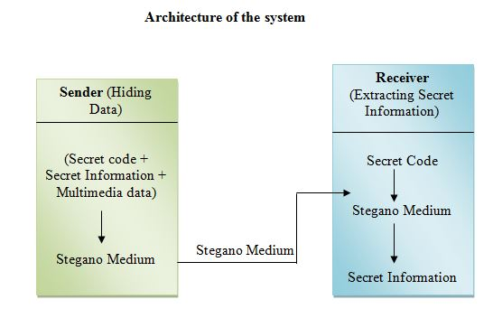

# Image-Stagenography
This project provides a GUI, a user friendlier system, where secret information can easily be hided with in a picture file. It attains all java futures. It is platform independent so that it can be used in any OS. Thus secret information can be transferred to the intended user without giving any suspicion to the unintended user.

In this project there are two modules, namely

1.	“Making stegano Medium”
2.	“Getting secret information from stegano medium”

Each of the modules is described in detail as follows. 
In making stegano Medium side, the secret information is hided with in an image file. Before hiding, for security, user has to enter a user code and secret information. A secret code will be generated using user code + secret information and this secret code will be used by the receiver to extract the secret information. After generating secret code stegano medium will be generated. This stegano medium is the final output and expected output from the sender side.

In getting secret information from stegano medium Side, Actually anyone may get this stegano medium that is picture with secret information, but only the person who knows secret code can read the message. Inputs for breaking the stegano medium are stegano mediam and secret code.
